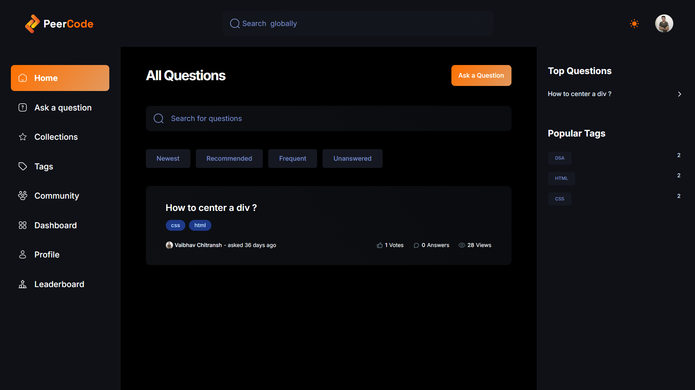
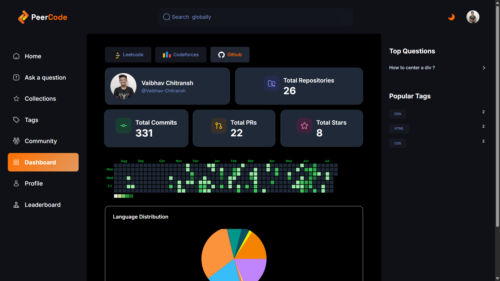
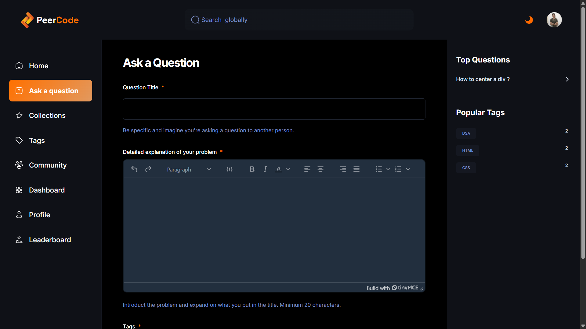
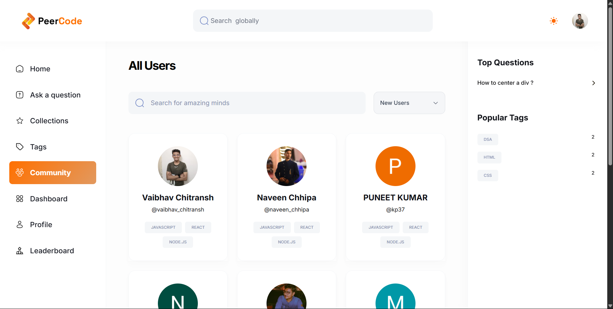
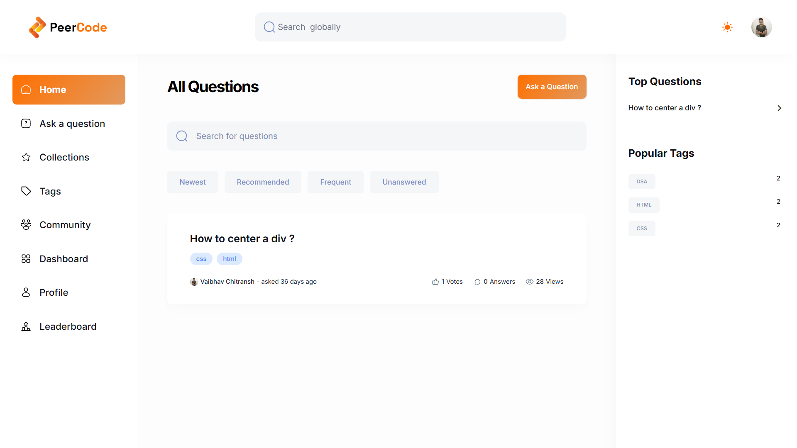
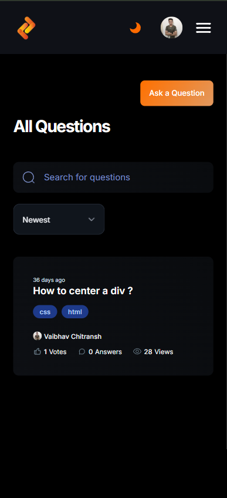
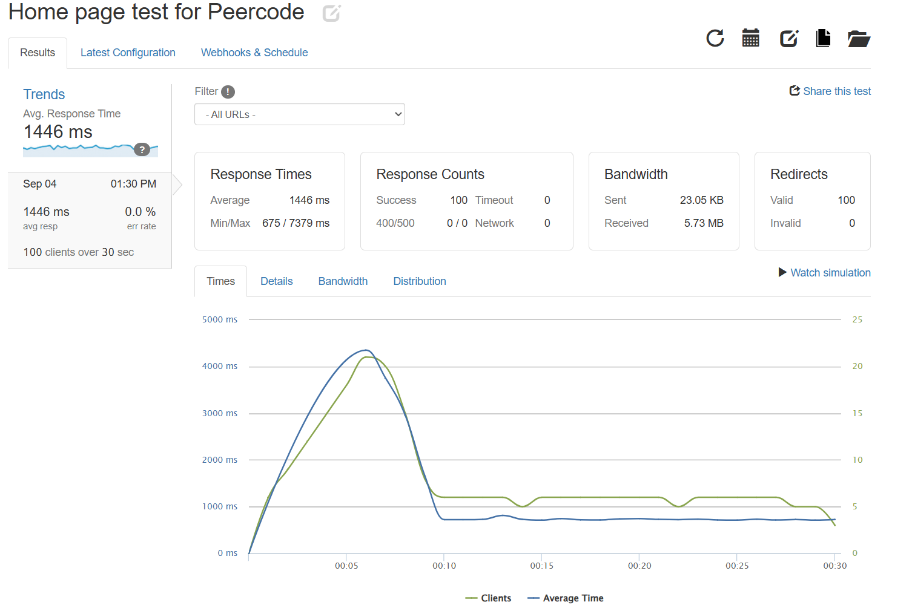
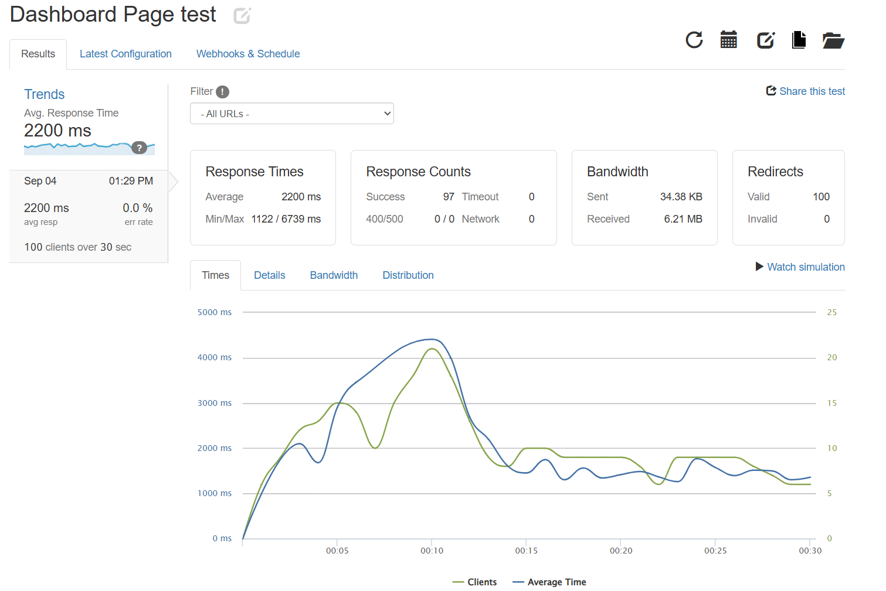
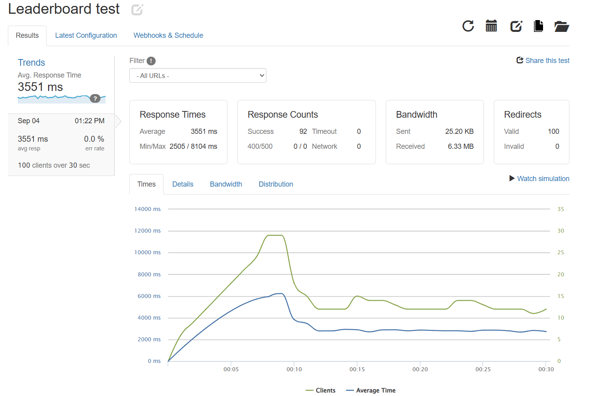

# PeerCode 🚀

A modern peer-to-peer coding platform where developers can ask questions, share knowledge, and build their programming skills together.

## ✨ Features

- 🔍 **Smart Question System** - Ask and answer coding questions with syntax highlighting
- 🏆 **Gamified Learning** - Earn points, badges, and climb leaderboards
- 📊 **Performance Analytics** - Track your coding journey with detailed statistics through personalized dashboard
- 🎯 **Tag-based Organization** - Organize questions by programming languages and topics
- 🌙 **Dark/Light Mode** - Seamless theme switching for better user experience
- 📱 **Responsive Design** - Perfect experience across all devices
- 🏆 **Leaderboard** – Compete with peers using a dynamic leaderboard powered by the custom P-Score algorithm, which ranks users based on problem-solving consistency, difficulty level, and platform diversity


## 🖼️ Screenshots

### Home Page

*Home Page showing Left and Right Sidebar and the list of all questions asked by users*

### Dashboard

*Main dashboard showing user statistics, recent activity, and performance metrics*



### Ask a Question Page

*Ask a Question including it's title, description and tags associated, Also there is Rich text editor for asking detailed programming questions*

### Profile Management

*User profile with statistics, badges, and recent activity*


### Tags Page

*Shows all the Tags for which questions were asked*

### Collections Page

*Shows saved Questions*

### Community Page

*Shows the list of all users on the platform*

### Leaderboard

*Global rankings based on user contributions and engagement derived from custom P-Score Algorithm*

## 🎨 User Experience

### Dark Mode
The platform features a sleek dark theme that's easy on the eyes during long coding sessions.


### Light Mode
Clean and professional light theme for daytime usage.



### Mobile Responsive
Fully optimized for mobile devices with touch-friendly interfaces.



## 🛠️ Tech Stack

- **Frontend Framework**: [Next.js 14](https://nextjs.org/) - React framework for production
- **Language**: [TypeScript](https://www.typescriptlang.org/) - Type-safe JavaScript
- **Styling**: [Tailwind CSS](https://tailwindcss.com/) - Utility-first CSS framework
- **UI Components**: [shadcn/ui](https://ui.shadcn.com/) - Re-usable components built with Radix UI
- **Rich Text Editor**: [TinyMCE](https://www.tiny.cloud/) - Advanced WYSIWYG editor
- **Database**: [MongoDB](https://www.mongodb.com/) - Flexible Database
- **Authentication**: [Clerk](https://clerk.com/) - Also Provides OAuth and built-in UI Components
- **Deployment**: [Vercel](https://vercel.com/) - Optimal for Next.js applications

## 📱 Pages & Features

### 1. Dashboard
- **Overview**: Central hub displaying user statistics and recent activity
- **Features**: 
  - Personal performance metrics
  - Rating chart with progress tracking
  - Level-wise problem solving statistics
  - Quick access to platform integrations (LeetCode, CodeForces, GitHub)

### 2. Home Page
- **Overview**: Browse and discover coding questions from the community
- **Features**:
  - Advanced filtering (Newest, Recommended, Frequent, Unanswered)
  - Search functionality
  - Tag-based categorization
  - Vote and view count tracking

### 3. Ask a Question
- **Overview**: Create detailed programming questions with rich formatting
- **Features**:
  - Rich text editor with code syntax highlighting
  - Tag selection for proper categorization
  - Question title and detailed explanation fields
  - Preview functionality

### 4. User Profile
- **Overview**: Personal profile management and statistics
- **Features**:
  - Achievement badges (Gold, Silver, Bronze)
  - Question and answer statistics
  - Recent activity timeline
  - Profile edit options

### 5. Tags System
- **Overview**: Organize content by programming languages and topics
- **Features**:
  - Popular tags showcase
  - Tag-based question filtering
  - Question count per tag
  - Search and discovery

### 6. Collections
- **Overview**: Save and organize favorite questions
- **Features**:
  - Personal question bookmarks
  - Custom collection creation
  - Easy access to saved content
  - Sorting and filtering options

### 7. Leaderboard
- **Overview**: Global and community rankings
- **Features**:
  - Point-based ranking system
  - User performance comparison
  - Achievement recognition
  - Competitive programming integration


## 🧪 Load Testing

To validate the performance and scalability of **PeerCode**, load testing was conducted using [Loader.io](https://loader.io).  
The application was tested across **core features** — Home page, Dashboard, and Leaderboard — with **100 concurrent users**.

### Results Summary
- ✅ **0% error rate** across all tests  
- ⚡ Average response times:
  - Home Page → ~1.4s  
  - Dashboard → ~2.2s  
  - Leaderboard → ~3.5s  

---

### 📊 Test Results

#### Home Page


#### Dashboard


#### Leaderboard



## 🚀 Getting Started

### Prerequisites

Make sure you have the following installed on your system:
- **Node.js** (v18 or higher)
- **npm** or **yarn** or **pnpm**

### Installation

1. **Clone the repository**
   ```bash
   git clone https://github.com/Vaibhav-Chitransh/peercode.git
   cd peercode
   ```

2. **Install dependencies**
   ```bash
   # Using npm
   npm install

   # Using yarn
   yarn install

   # Using pnpm
   pnpm install
   ```

3. **Set up environment variables**
   
   Update the `.env.local` file with your configuration:
   ```env
    NEXT_PUBLIC_CLERK_PUBLISHABLE_KEY=
    NEXT_PUBLIC_CLERK_SIGN_UP_URL=
    NEXT_PUBLIC_TINY_EDITOR_API_KEY =
    MONGO_URL = 
    SIGNING_SECRET = 
    NEXT_PUBLIC_SERVER_URL =
    OPENAI_API_KEY = 
    NEXT_PUBLIC_GEMINI_API_KEY = 
    GITHUB_TOKEN = 
   ```

## 📦 Project Structure

```
peercode/
├── app/                    # Next.js app directory
│   ├── (auth)/            # Authentication pages
│   ├── (root)/       # Dashboard pages
│   ├── api/               # API routes
│   └── globals.css        # Global styles
├── components/            # Reusable UI components
│   ├── ui/               # shadcn/ui components
│   ├── forms/            # Form components
│   └── layout/           # Layout components
├── lib/                  # Utility functions
│   ├── utils.ts         # General utilities
│   ├── db.ts           # Database 
├── hooks/               # Custom React hooks
├── types/              # TypeScript type definitions
├── public/             # Static assets
```

## 🤝 Contributing

We welcome contributions from the community! Here's how you can help:

1. **Fork the repository**
2. **Create a feature branch** (`git checkout -b feature/amazing-feature`)
3. **Commit your changes** (`git commit -m 'Add amazing feature'`)
4. **Push to the branch** (`git push origin feature/amazing-feature`)
5. **Open a Pull Request**

### Development Guidelines

- Follow the existing code style and conventions
- Write meaningful commit messages
- Add tests for new features
- Update documentation as needed


## 👥 Contributors

- [**Vaibhav Chitransh**](https://github.com/Vaibhav-Chitransh)  
- [**Naveen Chhipa**](https://github.com/Naveen-Chhipa)  

We welcome contributions! Feel free to explore the project, open issues, or submit pull requests.


---

<div align="center">
  <p>Made with ❤️ by the PeerCode team</p>
  <p>
    <a href="https://github.com/yourusername/peercode">⭐ Star us on GitHub</a> |
    <a href="https://peercode-two.vercel.app/">🌐 Visit Website</a>
  </p>
</div>